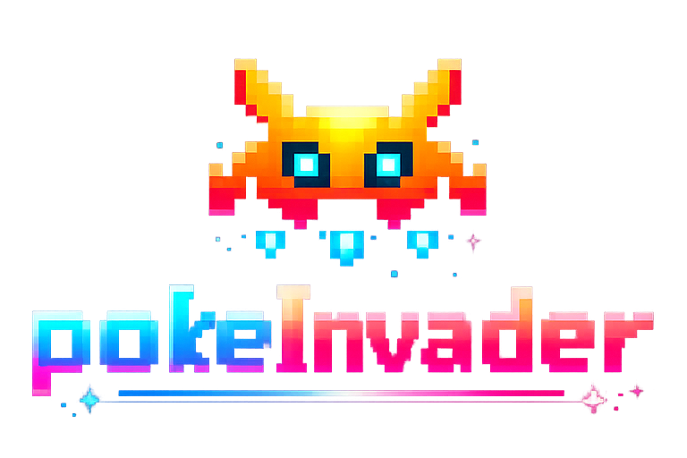

# pokemon-space-invader



A simple Space-Invader-style game implemented in Python using Pygame and Pokemon-themed sprites. It's sometimes playable yes sometimes unplayable due to high frequency of updates.

## About me and the projects

Hello, I am a software engineer and a big pokemon fan. This project starting from me wanting to make a simple game for my gf with fun purposes. But I decided to make it into something bigger, wishing to let more people enjoy the game. It still in early-developed stage, but any comments or contribution are very very welcomed.

## Features

- Player spaceship with health and multiple fire modes
- Multiple alien types and bosses
- Collectible power-ups
- Explosion/animation effects and sound

## Requirements

- Python 3.8+ (or your system Python 3)
- pygame

Install pygame with pip if you don't have it:

```bash
pip install pygame
```

On some systems you may need `python3` and `pip3` instead of `python`/`pip`.

Download the images for pokemon

Gen2 sprites came with white backgrounds. I use [piskelapp.com](https://www.piskelapp.com/) to eliminate background.

```
mkdir img/pokemon
python3 download_pokemon_items.py
python3 download_pokemon_sprites.py
```


Download the images for Hong Bao from [here](https://witpop.itch.io/sprite-pack-hred-envelope-icons). Extract it and put it under `img/`

Dwonload the images for other sprites from [here](https://clockworkraven.itch.io/raven-fantasy-icons). Extract it and put it under `img/`

Extract it and move `64x64/` under the root `Free - Raven Fantasy Icons/` folder.

## Running the game

From the project root run:

```bash
python main.py
```

If that doesn't work, try:

```bash
python3 main.py
```

## Controls

Up/Down/Left/Right to control your ships

Space to fire

Mouse Click to retrieve item rewards

## TODO (GamePlay)

- Finish inventory
- Add more stages
- Add more attacks
- Add more items
- Add pokeballs and pokemon catching system
- Improve attack system (type, pp, power...)
- Improve visual effects

## TODO (Tech & Bugs)

- Add unit tests for non-graphical logic (collision resolver, spawn logic)
- Keep Improving code qaulity

- Known Bug: when game pause (choose item), time/frame counters won't be stop (e.g. instant refire)

## TODO (Description)

- Add a `requirements.txt` for pinning dependencies
- Add a short controls section to the README
- Add screenshots and/or a short recorded GIF to show gameplay
- Add packaging or a simple launcher script
- Add description(tutorial) before starting the game

## References & Assets

Respect all asset licenses, copyrights and creators when redistributing.

Red Envelope: [Link](https://witpop.itch.io/sprite-pack-hred-envelope-icons)
    or Check the `img/Red Envelope Starter Pack/READ ME CC-BY-NC.txt` for asset credits and license details.

Pokemon Sprites: [Link](https://pokemondb.net/)

Pokemon Move Effects: [Link](https://www.spriters-resource.com/game_boy_advance/pokemonrubysapphire/asset/28884/)

Original Space Invaders, Aliens, Explosion, Sound Effects: [Link](http://www.codingwithruss.com/gamepage/Invaders/)

Raven Fantasy Icons - Full Collection: [Link](https://clockworkraven.itch.io/raven-fantasy-icons)

## License

This repository does not include a license file by default. Add a LICENSE file if you plan to publish or share the project publicly.

---

Thank you
